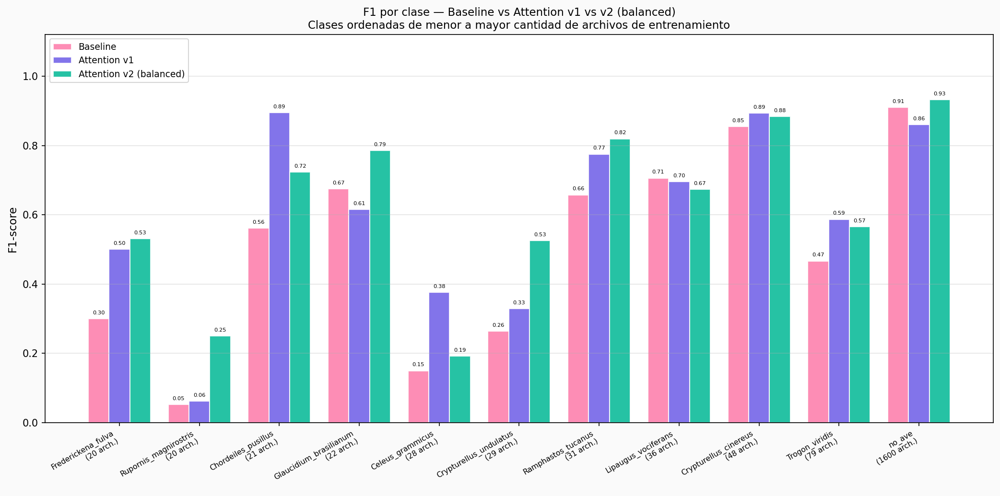
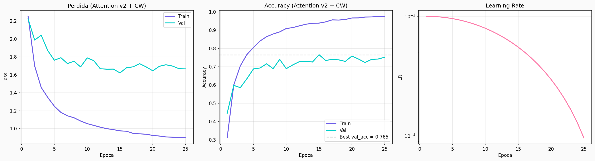
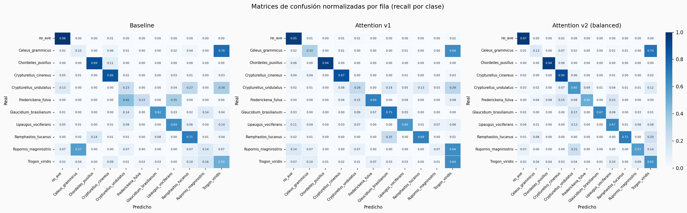
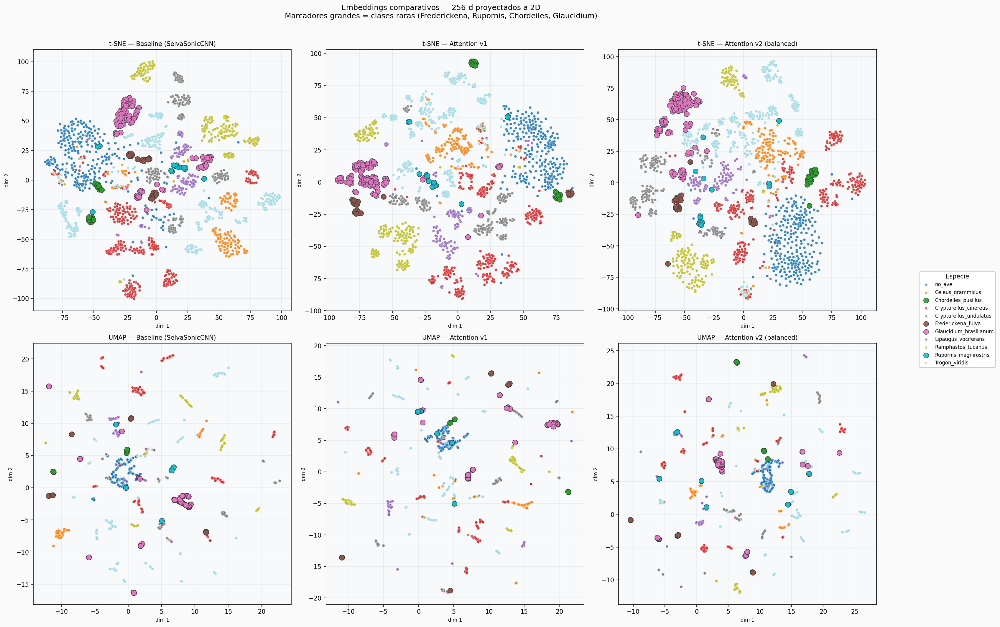
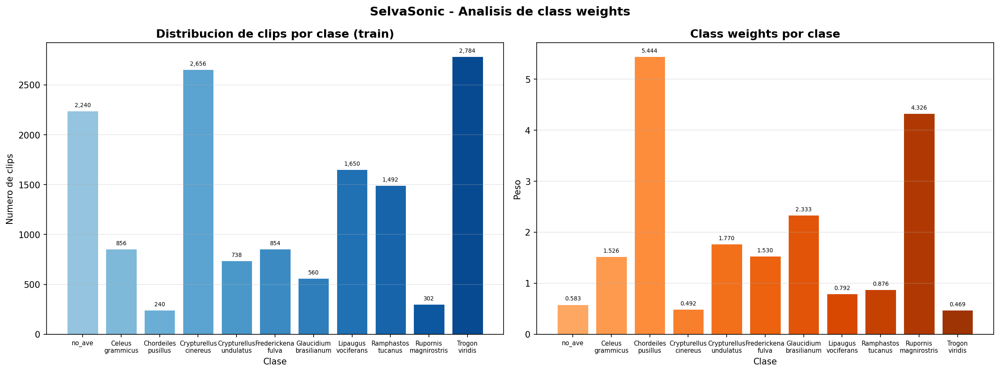

<p align="center">
  
</p>

<h1 align="center">🌳 SelvaSonic-ML</h1>

<p align="center">
  <strong>Clasificador bioacústico de aves amazónicas colombianas</strong><br/>
  CNN + Multi-Head Self-Attention · 11 clases · 10 especies · Entrenado desde cero con PyTorch
</p>

<p align="center">
  
  
  
  
  
  
</p>

<p align="center">
  <b>Universidad Nacional de Colombia — Sede Medellín</b><br/>
  Aprendizaje Automático · Prof. Alcides Montoya · Junio 2026<br/>
  <b>Autores:</b> Laura Ruiz Arango &nbsp;·&nbsp; Jose Aldair Molina Méndez
</p>

---

<p align="center">
  <a href="#-resumen">Resumen</a> &nbsp;•&nbsp;
  <a href="#-motivación">Motivación</a> &nbsp;•&nbsp;
  <a href="#-resultados">Resultados</a> &nbsp;•&nbsp;
  <a href="#-arquitectura-del-modelo">Arquitectura</a> &nbsp;•&nbsp;
  <a href="#-dataset">Dataset</a> &nbsp;•&nbsp;
  <a href="#-instalación">Instalación</a> &nbsp;•&nbsp;
  <a href="#-uso">Uso</a> &nbsp;•&nbsp;
  <a href="#-estructura-del-repositorio">Estructura</a> &nbsp;•&nbsp;
  <a href="#-notebooks">Notebooks</a> &nbsp;•&nbsp;
  <a href="#-decisiones-metodológicas">Metodología</a> &nbsp;•&nbsp;
  <a href="#-referencias">Referencias</a>
</p>

---

## 📖 Resumen

SelvaSonic-ML es un sistema de clasificación bioacústica entrenado **desde cero** en PyTorch que identifica vocalizaciones de **10 especies de aves amazónicas colombianas** a partir de grabaciones de campo, más una clase de sonidos ambientales (`no_ave`).

El pipeline convierte cada audio en un Mel-espectrograma de 128 bandas que alimenta una arquitectura CNN + Multi-Head Self-Attention. El modelo final (**attention v2**) alcanza **70.4 % de accuracy en test** sobre 11 clases con desbalance severo, usando class weights inversamente proporcionales a la frecuencia de cada clase.

---

## 🎯 Motivación

Colombia es el **segundo país con mayor diversidad de aves del mundo** (~1 966 especies). El monitoreo bioacústico pasivo es la herramienta más eficiente para estudiar ecosistemas sin perturbación, pero la identificación de cantos depende de expertos escasos.

**¿Por qué entrenar desde cero?** Un trabajo previo del equipo (presentado en congreso de Ingeniería Física) usó modelos preentrenados como YAMNet y AST. Esta versión entrena su propia CNN para:

- 🔬 **Control total** de arquitectura e hiperparámetros
- 🧠 **Dominio del pipeline end-to-end**: no solo llamar una API, sino construirla
- 🌎 **Especialización** en fauna colombiana, donde los modelos preentrenados generalizan mal por sesgo hacia fauna norteamericana/europea en sus datos de preentrenamiento

---

## 📊 Resultados

### Comparativa de los 3 modelos entrenados

| Modelo | val_acc | test_acc | Macro F1 | Params | Características |
|---|---|---|---|---|---|
| Baseline (CNN) | 74.2 % | 63.2 % | 0.509 | 422 K | CNN puro, sin balanceo de clases |
| Attention v1 | 78.3 % | 68.7 % | 0.599 | 715 K | + Multi-Head Self-Attention |
| **Attention v2** ⭐ | 76.5 % | **70.4 %** | **0.625** | 715 K | + class weights inversos a la frecuencia |

> Los tres modelos comparten: `label_smoothing = 0.1`, `AdamW`, `CosineAnnealingLR`, `batch_size = 32`, `lr = 0.001`, `weight_decay = 1e-4`.

### Hallazgos clave

- ✅ **+7.1 pp test_acc** del baseline al modelo final (63.2 % → 70.4 %)
- ✅ **Gap val−test** se redujo de 10.97 pp (baseline) a **6.17 pp** (v2): el balanceo redujo el overfitting estructural hacia clases dominantes
- ✅ **Silhouette 20× mayor**: espacio de embeddings baseline = 0.0084 → v2 = 0.1686 (las clases se separan geométricamente de forma mucho más clara)
- ✅ **AP de clases raras mejoró drásticamente con class weights**: *Rupornis magnirostris* AP 0.045 → **0.511**
- ✅ **Confusiones taxonómicamente razonables**: los errores principales ocurren dentro del género *Crypturellus* (dos tinamúes del mismo género, acústicamente similares)



> Análisis completo en [`notebooks/13_comparativa_final_3_modelos.ipynb`](notebooks/13_comparativa_final_3_modelos.ipynb).

### Curvas de entrenamiento — Attention v2



### Matrices de confusión — 3 modelos



### Espacio de embeddings (t-SNE / UMAP)



> Ver análisis de separabilidad geométrica en [`notebooks/15_embeddings_comparativo_3_modelos.ipynb`](notebooks/15_embeddings_comparativo_3_modelos.ipynb).

---

## 🧠 Arquitectura del modelo

### Pipeline de procesamiento

```
Audio raw (.mp3 / .wav)
    │
    ▼  load + resample a 22 050 Hz  ·  conversión a mono  (librosa)
Waveform [T_samples]
    │
    ▼  segmentación en clips de 5 s  ·  overlap 50 % (solo en train)
Clips [N, T_5s]
    │
    ▼  Mel-spectrogram  (n_fft=2048 · hop=512 · n_mels=128 · fmin=50 Hz · fmax=11 025 Hz)
Mel-spectrograms [N, 128, T_frames]
    │
    ▼  z-score normalization por clip
Tensor [N, 1, 128, T_frames]
    │
    ▼  SelvaSonicCNNAttention
Logits [N, 11]  →  Softmax  →  Predicción + Confianza
```

### Arquitectura `SelvaSonicCNNAttention` — modelo final (715 K parámetros)

```
Input [B, 1, 128, T]
    │
    ▼  Conv Block 1 : Conv2D(  1 → 32,  3×3, pad=1) + BN + ReLU + MaxPool(2×2)
    ▼  Conv Block 2 : Conv2D( 32 → 64,  3×3, pad=1) + BN + ReLU + MaxPool(2×2)
    ▼  Conv Block 3 : Conv2D( 64 → 128, 3×3, pad=1) + BN + ReLU + MaxPool(2×2)
    ▼  Conv Block 4 : Conv2D(128 → 256, 3×3, pad=1) + BN + ReLU + MaxPool(2×2)
    │                                            ↑ feature extractor compartido con baseline
    ▼  AdaptiveAvgPool2d(8, 14)  →  reshape  →  112 tokens  [B, 112, 256]
    │
    ▼  + Positional Encoding aprendible  [1, 112, 256]  (init N(0, 0.02))
    ▼  Multi-Head Self-Attention  (num_heads=4, embed_dim=256, attn_dropout=0.1)
    ▼  Conexión residual  +  LayerNorm  (post-norm, Vaswani et al. 2017)
    │
    ▼  Global Average Pooling sobre tokens  →  [B, 256]
    │
    ▼  FC: 256 → 128  →  ReLU  →  Dropout(0.3)  →  11 (logits)
```

`SelvaSonicCNN` (baseline, 422 K parámetros) omite el bloque de atención: aplica directamente `AdaptiveAvgPool2d(1,1)` → flatten → FC.

### Decisiones de diseño

| Decisión | Justificación |
|---|---|
| CNN como extractor de features | Captura patrones tiempo-frecuencia locales (trinos, armónicos, sílabas) |
| MHSA sobre la secuencia temporal | Captura dependencias de largo alcance entre frames del canto |
| Positional encoding aprendible | El dominio bioacústico tiene patrones posicionales específicos por especie; PE aprendible los captura mejor que sinusoidal fijo |
| Post-norm residual | Punto de partida canónico; con un solo bloque de atención es suficientemente estable |
| Class weights `w_c = N / (K·n_c)` | Compensa el desbalance severo (no_ave tiene ~17× más clips que *Rupornis magnirostris*) |
| Label smoothing α = 0.1 | Previene el overconfidence bias detectado en v1: predicciones >0.95 incluso en audios ambiguos de campo |

Justificación técnica detallada en [`docs/decisiones_metodologicas.md`](docs/decisiones_metodologicas.md).

---

## 🗂 Dataset

### Fuentes

| Fuente | Descripción | Clases | Total clips |
|---|---|---|---|
| [Xeno-canto](https://xeno-canto.org/) | 334 grabaciones de 10 especies amazónicas colombianas, calidad A/B | 10 | ~8 207 |
| [ESC-50](https://github.com/karolpiczak/ESC-50) | 1 600 clips de 5 s de sonidos ambientales (excluye categoría *Animals*) | 1 (`no_ave`) | 1 600 |
| **Total** | | **11** | **~9 807** |

División: **70 % train / 15 % val / 15 % test**, estratificada **a nivel de archivo** (no de clip) para prevenir data leakage entre splits.

### Especies (10 aves amazónicas, 8 familias)

| Especie | Nombre común | Familia | Grabaciones |
|---|---|---|---|
| *Trogon viridis* | Trogón coliblanco | Trogonidae | 79 |
| *Crypturellus cinereus* | Tinamú cenizo | Tinamidae | 48 |
| *Lipaugus vociferans* | Piha gritona | Cotingidae | 36 |
| *Ramphastos tucanus* | Tucán piquirrojo | Ramphastidae | 31 |
| *Crypturellus undulatus* | Tinamú ondulado | Tinamidae | 29 |
| *Celeus grammicus* | Carpintero escamado | Picidae | 28 |
| *Glaucidium brasilianum* | Buhito ferruginoso | Strigidae | 22 |
| *Chordeiles pusillus* | Añapero chico | Caprimulgidae | 21 |
| *Rupornis magnirostris* | Gavilán pollero | Accipitridae | 20 |
| *Frederickena fulva* | Batará leonado | Thamnophilidae | 20 |

Los audios de Xeno-canto se segmentan en clips de 5 s con overlap 50 % (solo en train), produciendo en promedio ~4.7 clips por grabación. ESC-50 ya viene en clips de 5 s exactos (sin segmentación adicional).

### Distribución de clases y class weights



El desbalance es severo: `no_ave` tiene ~17× más clips que *Rupornis magnirostris* (la clase más pequeña). En `attention v2` los pesos van de **0.47** (no_ave, penalizada) a **5.44** (*Rupornis*, favorecida).

---

## ⚙️ Instalación

### Requisitos previos

- Python 3.10+
- GPU recomendada para reentrenar (el entrenamiento original se realizó en Google Colab T4)
- ~500 MB para el código y los resultados; ~2 GB adicionales para los audios

### Setup local

```powershell
# Clonar el repositorio
git clone https://github.com/LauraRuizA09/SelvaSonic-ML.git
cd SelvaSonic-ML

# Crear entorno virtual
python -m venv venv
.\venv\Scripts\Activate.ps1          # Windows / PowerShell
# source venv/bin/activate           # Linux / macOS

# Instalar dependencias
pip install -r requirements.txt

# Verificar
python -c "import torch, librosa; print(f'PyTorch {torch.__version__} | GPU: {torch.cuda.is_available()}')"
```

### Recursos no incluidos en el repositorio

| Recurso | Ruta | Cómo obtener |
|---|---|---|
| Audios originales | `data/raw/` | Scripts de descarga en `notebooks/` (ver [Uso](#-uso)) |
| Checkpoints `.pth` | `results/runs/*/best.pth` | Reentrenar o solicitar acceso al Drive del equipo |
| Class weights | `data/class_weights.pt` | `python scripts/calcular_class_weights.py` |

> Los archivos `.pth` están excluidos de git por la regla `results/runs/**/*.pth` en `.gitignore`. Los PNGs y JSONs de `results/` **sí están versionados**.

---

## 🚀 Uso

### Inferencia sobre un audio nuevo

```powershell
python -m src.inference --audio ruta/al/audio.wav --model results/runs/attention_S4_v2_20260602_1332/best.pth
```

Flags disponibles:

| Flag | Descripción |
|---|---|
| `--audio <archivo>` | Archivo de audio individual (.mp3, .wav, .flac, .ogg) |
| `--batch <carpeta>` | Procesa todos los audios en una carpeta |
| `--model <ruta.pth>` | Checkpoint entrenado (obligatorio) |
| `--threshold <float>` | Umbral de confianza; por debajo reporta "No identificado" (default: 0.5) |
| `--json <salida.json>` | Guardar resultados en JSON |
| `--device auto\|cpu\|cuda` | Dispositivo de inferencia (default: auto) |

### Reentrenar desde cero

```powershell
# 1. Descargar audios de Xeno-canto
python notebooks/02_descarga_audios.py

# 2. Descargar ESC-50
python notebooks/03_descarga_esc50_negativos.py

# 3. Calcular class weights (genera data/class_weights.pt)
python scripts/calcular_class_weights.py

# 4. Entrenar
python -m src.run_training
```

> Para entrenamiento con GPU: usar los notebooks de Colab incluidos en `notebooks/` (`SelvaSonic_Training_V4_Attention.ipynb` para v1, `training_V5_attention_balanced.ipynb` para v2).

### Demo ejecutiva (recomendado para revisores)

```powershell
jupyter notebook notebooks/17_demo_final.ipynb
```

El notebook 17 presenta arquitectura, resultados, demo en vivo con tres audios de referencia, y análisis de hallazgos. No requiere descargar audios adicionales.

### TensorBoard

```powershell
tensorboard --logdir results/runs/attention_S4_v2_20260602_1332
```

Si se quiere reconstruir los logs desde el historial JSON (útil si se entrena en Colab):

```powershell
python scripts/history_to_tensorboard.py
tensorboard --logdir results/runs
```

---

## 📁 Estructura del repositorio

```
SelvaSonic-ML/
│
├── README.md                                    ← este archivo
├── LICENSE                                      ← MIT
├── requirements.txt                             ← dependencias Python
├── .gitignore
├── config.yaml                                  ← hiperparámetros en YAML
├── check_dataset.py                             ← verificación de integridad del dataset
│
├── assets/
│   └── selvasonic_banner.png
│
├── src/                                         ← código fuente principal
│   ├── config.py                ← fuente única de verdad: sample rate, paths, hparams
│   ├── audio_io.py              ← carga de audio, resampleo a 22 050 Hz, mono
│   ├── transforms.py            ← Mel-espectrograma (128 bandas) + normalización z-score
│   ├── segmentation.py          ← corte en clips de 5 s con overlap configurable
│   ├── augmentation.py          ← time stretch · pitch shift · add noise
│   ├── dataset.py               ← AmazonAudioDataset + DataLoaders estratificados por archivo
│   ├── model.py                 ← SelvaSonicCNN (422 K) · SelvaSonicCNNAttention (715 K)
│   ├── train.py                 ← training loop · early stopping · checkpointing · logging
│   ├── run_training.py          ← entry point de entrenamiento
│   ├── inference.py             ← motor de inferencia (CLI + API Python)
│   ├── class_weights.py         ← cómputo de pesos w_c = N / (K·n_c)
│   ├── loss.py                  ← CrossEntropyLoss con class weights + label smoothing
│   ├── logger.py                ← TensorBoard: loss, accuracy, confusion matrix, LR
│   └── __init__.py
│
├── scripts/                                     ← utilidades CLI auxiliares
│   ├── calcular_class_weights.py   ← genera data/class_weights.pt + PNGs en results/
│   ├── history_to_tensorboard.py   ← convierte history.json → logs de TensorBoard
│   └── __init__.py
│
├── notebooks/                                   ← análisis, entrenamientos y demo
│   ├── 01_EDA_audio.py                          ← exploración inicial del dataset (script)
│   ├── 02_descarga_audios.py                    ← descarga de grabaciones Xeno-canto (script)
│   ├── 02_visualizacion_dataset.ipynb           ← distribución de clases + espectrogramas
│   ├── 03_descarga_esc50_negativos.py           ← descarga y preparación de ESC-50 (script)
│   ├── 04_analisis_errores_baseline.ipynb       ← análisis de errores del baseline CNN
│   ├── 05_evaluacion_rigurosa.ipynb             ← F1 · AUC-ROC · AP · confusion matrix
│   ├── 06_comparacion_embeddings.ipynb          ← embeddings t-SNE/UMAP baseline vs v1
│   ├── 07_evaluacion_rigurosa_attention.ipynb   ← métricas completas attention v1
│   ├── 08_analisis_errores_attention.ipynb      ← análisis de errores attention v1
│   ├── 09_comparacion_baseline_vs_attention.ipynb ← comparativa directa v1 vs baseline
│   ├── 11_test_audios_amazonas.ipynb            ← test cualitativo con grabaciones de campo
│   ├── 12_analisis_class_weights.ipynb          ← análisis del desbalance y estrategia de balanceo
│   ├── 13_comparativa_final_3_modelos.ipynb  ⭐ ← comparativa de métricas 3 modelos
│   ├── 14_gradcam_visualizacion.ipynb           ← Grad-CAM: qué aprende cada modelo
│   ├── 15_embeddings_comparativo_3_modelos.ipynb ← t-SNE · UMAP · silhouette 3 modelos
│   ├── 16_test_audios_externos_3_modelos.ipynb  ← test con grabaciones de Puerto Nariño
│   ├── 17_demo_final.ipynb                   ⭐ ← demo ejecutiva del proyecto
│   ├── SelvaSonic_Training_V4_Attention.ipynb   ← training run v1 (Google Colab)
│   ├── teoria_stft_mel_mfcc.ipynb               ← referencia teórica: STFT · Mel · MFCC
│   └── training_V5_attention_balanced.ipynb     ← training run v2 balanced (Google Colab)
│
├── data/                                        ← ⚠️ NO en git (ver .gitignore)
│   ├── raw/                     ← audios originales (.mp3 Xeno-canto · .wav ESC-50)
│   ├── metadata.csv             ← 334 filas × 16 cols (id, especie, familia, región…)
│   ├── metadata_negativos.csv   ← 1 600 filas × 8 cols (ESC-50)
│   └── class_weights.pt         ← tensor [11] de pesos — regenerar con scripts/
│
├── results/                                     ← PNGs y JSONs en git · .pth NO
│   ├── runs/
│   │   ├── baseline_S3_v2_20260527_0118/        ← CNN baseline
│   │   ├── attention_S4_v1_20260601_0334/       ← CNN + MHSA
│   │   └── attention_S4_v2_20260602_1332/    ⭐ ← modelo final
│   ├── comparativa/                             ← notebook 13 (f1, confusion, calibración)
│   ├── comparacion_baseline_vs_attention/       ← notebooks 06–09
│   ├── embeddings/                              ← notebook 15 (t-SNE, UMAP, silhouette)
│   ├── gradcam/                                 ← notebook 14 (Grad-CAM por clase)
│   ├── test_externos/                           ← notebook 16 (Puerto Nariño)
│   ├── external_test/                           ← resultados comparativos adicionales
│   ├── class_weights_distribution.png
│   └── class_weights_ratios.png
│
└── docs/
    ├── decisiones_metodologicas.md              ← justificaciones técnicas del proyecto
    └── TENSORBOARD.md                           ← guía de uso de TensorBoard
```

---

## 📓 Notebooks

| # | Archivo | Tipo | Tema |
|---|---|---|---|
| 01 | `01_EDA_audio.py` | Script | Exploración inicial del dataset de audio |
| 02a | `02_descarga_audios.py` | Script | Descarga de grabaciones desde Xeno-canto API |
| 02b | `02_visualizacion_dataset.ipynb` | Notebook | Distribución de clases + espectrogramas de ejemplo |
| 03 | `03_descarga_esc50_negativos.py` | Script | Descarga y preparación de ESC-50 |
| 04 | `04_analisis_errores_baseline.ipynb` | Notebook | Análisis de errores del baseline CNN |
| 05 | `05_evaluacion_rigurosa.ipynb` | Notebook | F1 · AUC-ROC · AP · confusion matrix del baseline |
| 06 | `06_comparacion_embeddings.ipynb` | Notebook | Embeddings t-SNE/UMAP: baseline vs attention |
| 07 | `07_evaluacion_rigurosa_attention.ipynb` | Notebook | Métricas completas del modelo attention v1 |
| 08 | `08_analisis_errores_attention.ipynb` | Notebook | Análisis de errores attention v1 |
| 09 | `09_comparacion_baseline_vs_attention.ipynb` | Notebook | Comparativa directa baseline vs attention v1 |
| 11 | `11_test_audios_amazonas.ipynb` | Notebook | Test cualitativo con grabaciones de campo reales |
| 12 | `12_analisis_class_weights.ipynb` | Notebook | Análisis del desbalance y estrategia de balanceo (Fase 3) |
| **13** | `13_comparativa_final_3_modelos.ipynb` | **Notebook ⭐** | **Comparativa de métricas de los 3 modelos** |
| 14 | `14_gradcam_visualizacion.ipynb` | Notebook | Grad-CAM: interpretabilidad baseline vs attention v2 |
| 15 | `15_embeddings_comparativo_3_modelos.ipynb` | Notebook | t-SNE · UMAP · silhouette de los 3 modelos |
| 16 | `16_test_audios_externos_3_modelos.ipynb` | Notebook | Test con grabaciones reales de Puerto Nariño, Amazonas |
| **17** | `17_demo_final.ipynb` | **Notebook ⭐** | **Demo ejecutiva del proyecto completo** |
| — | `SelvaSonic_Training_V4_Attention.ipynb` | Notebook | Entrenamiento en Colab: attention v1 |
| — | `teoria_stft_mel_mfcc.ipynb` | Notebook | Referencia teórica: STFT · Mel-espectrogramas · MFCC |
| — | `training_V5_attention_balanced.ipynb` | Notebook | Entrenamiento en Colab: attention v2 (balanced) |

---

## 🔬 Decisiones metodológicas

Tres decisiones no obvias, documentadas con justificación completa en [`docs/decisiones_metodologicas.md`](docs/decisiones_metodologicas.md):

### 1. Class weights antes que hyperparameter tuning

El análisis de errores del baseline reveló una **correlación positiva entre tamaño de clase y F1-score**: sin balanceo, *Rupornis magnirostris* obtenía F1 = 0.05 con un support de solo 14 clips en test. El cuello de botella real era el desbalance, no los hiperparámetros. Atacar primero el problema de mayor impacto evitó un grid search de ~27 entrenamientos sobre una loss estructuralmente sesgada. Con class weights en v2, el AP de *Rupornis* sube de **0.045 a 0.511**.

### 2. AP como métrica de referencia bajo desbalance severo

En el baseline, *Rupornis magnirostris* tiene AUC-ROC = 0.850 pero AP = 0.045. La curva ROC es engañosa cuando una clase domina: el alto número de verdaderos negativos infla el FPR. Average Precision ignora los verdaderos negativos y refleja el rendimiento real en clases raras. Para la métrica de resumen global se reporta macro F1 en lugar de accuracy o AUC-ROC macro.

### 3. Sistema de rechazo "No identificado" diferido

El test cualitativo de campo (notebook 11) reveló **overconfidence bias** en attention v1: predicciones >0.95 en grabaciones de Puerto Nariño con múltiples especies simultáneas. Label smoothing (α = 0.1) mitiga el problema durante el entrenamiento. La calibración formal con Temperature Scaling (Guo et al., 2017) y el umbral óptimo de rechazo están diferidos: requieren calibración sobre un val set verdaderamente independiente del de entrenamiento.

---

## ⚠️ Limitaciones

- **Dataset pequeño**: ~9 807 clips de 334 grabaciones. La generalización fuera de la Amazonía colombiana no está garantizada.
- **Solo 10 especies** de las 562 registradas en la región en Xeno-canto.
- **Audios de campo extensos y ruidosos** se clasifican mayoritariamente como `no_ave`, comportamiento esperado y verificado con grabaciones de Puerto Nariño (notebook 16).
- **Sin umbral de rechazo calibrado formalmente**: el valor por defecto (0.5) es funcional pero no ha sido optimizado.
- **ECE de v2 = 0.145 vs 0.039 de v1**: los class weights mejoran la separabilidad de clases pero distorsionan las probabilidades brutas del softmax, empeorando la calibración probabilística.

---

## 🚧 Trabajo futuro

- 🦅 Escalar a 50+ especies con BirdCLEF + más grabaciones de Xeno-canto
- 📏 Temperature Scaling post-hoc + umbral de confianza optimizado con curvas ROC sobre val set independiente
- 🔁 Transfer learning desde BirdNET o PANNs como feature extractor
- 🎛 SpecAugment (Park et al., 2019): time masking y frequency masking sobre espectrogramas
- 🔍 Hyperparameter tuning sistemático con Bayesian Optimization (Optuna) sobre GPU dedicada
- 📱 Despliegue edge para monitoreo bioacústico continuo en campo

---

## 📚 Referencias

- Gong, Y., Chung, Y.-A., & Glass, J. (2021). **AST: Audio Spectrogram Transformer**. *Proc. Interspeech 2021*.
- Kong, Q., et al. (2020). **PANNs: Large-scale pretrained audio neural networks for audio pattern recognition**. *arXiv:1912.10211*.
- Müller, R., Kornblith, S., & Hinton, G. (2019). **When Does Label Smoothing Help?** *Advances in NeurIPS 2019*.
- Guo, C., Pleiss, G., Sun, Y., & Weinberger, K. Q. (2017). **On Calibration of Modern Neural Networks**. *ICML 2017*.
- Park, D. S., et al. (2019). **SpecAugment: A Simple Data Augmentation Method for Automatic Speech Recognition**. *Interspeech 2019*.
- Vaswani, A., et al. (2017). **Attention Is All You Need**. *NeurIPS 2017*.
- Piczak, K. J. (2015). **ESC: Dataset for environmental sound classification**. *Proc. ACM Multimedia*.
- Vellinga, W.-P., & Planqué, R. (2015). **The Xeno-canto collection and its relation to sound recognition and classification**. *CLEF Working Notes*.

---

## 👥 Créditos

**Equipo de desarrollo:**

| Nombre | Rol principal |
|---|---|
| **Laura Ruiz Arango** | Pipeline de datos, entrenamiento, evaluación, análisis de embeddings, documentación |
| **Jose Aldair Molina Méndez** | Arquitectura del modelo, data augmentation, análisis de errores, Grad-CAM |

**Supervisión académica:**
Prof. Alcides Montoya C. — Aprendizaje Automático, UNAL Medellín

**Datos:**
- Xeno-canto Foundation ([xeno-canto.org](https://xeno-canto.org)) — grabaciones bajo licencia CC
- ESC-50 — Karol J. Piczak ([github.com/karolpiczak/ESC-50](https://github.com/karolpiczak/ESC-50))

**Stack:** PyTorch · librosa · torchaudio · scikit-learn · TensorBoard · matplotlib · seaborn · pandas · numpy

---

## 📄 Licencia

Este proyecto está bajo la [licencia MIT](LICENSE).

Copyright © 2026 Laura Ruiz Arango & Jose Aldair Molina Méndez

---

<p align="center">
  <em>"Escuchando la Amazonía con Machine Learning"</em> 🌳🐦
</p>
